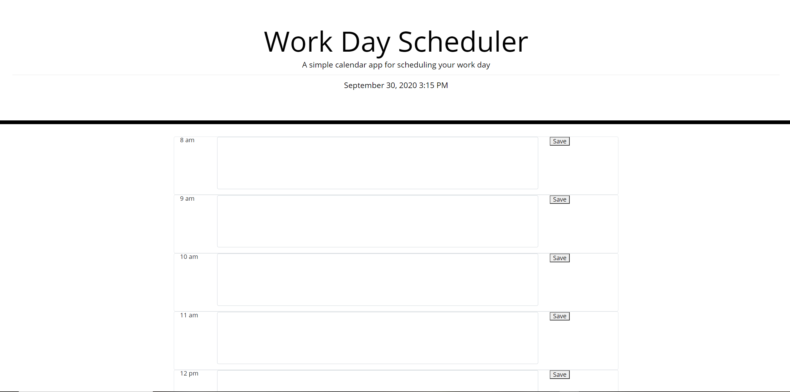
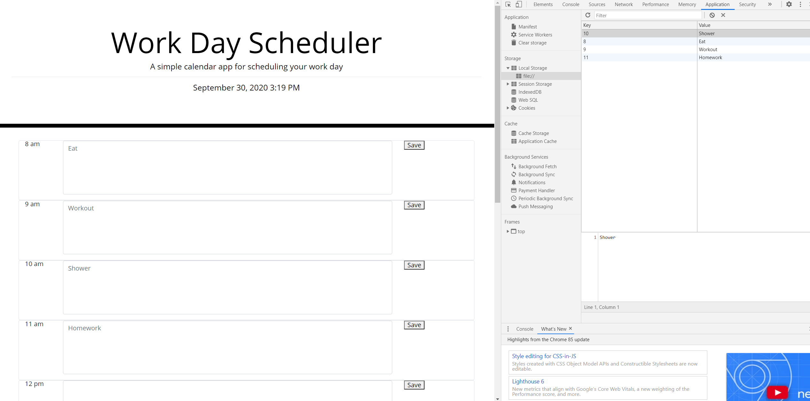

This is the unit 5 homework for UPenn LPS Coding Bootcamp.
For this assignment, I am to create a functioning and dynamic daily planner. I assume I am to 
familiarize myself with jQuery and moment.js in order to succeed in this endeavor.
_____________________________________________________________________________________________________

